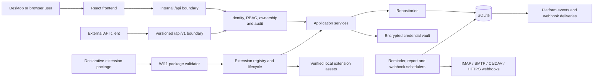

# Architecture

## Current implemented architecture

WhiteLabelCRM is a local-first TypeScript npm workspace monorepo:

- `shared/` contains common runtime contracts and Zod validation schemas;
- `backend/` contains the Express application, services, repositories, SQLite persistence, migrations, schedulers, integrations, backup management and PDF generation;
- `frontend/` contains the React/Vite single-page application;
- `desktop/` contains the Electron main/preload boundary and Forge packaging configuration;
- `scratch/` contains deterministic smoke, migration and release-validation scripts.



## Runtime boundaries

The backend owns persistence, migrations, backups, imports, PDF generation, credentials, extension package validation and external network operations. Business logic does not move into the Electron renderer. Electron embeds the built frontend and starts the backend through the desktop shell.

The default backend listener is loopback-only. Browser/server deployments may bind differently through explicit runtime configuration and must use authenticated sessions.

## Security boundary

WI8–WI9 introduced one request-security boundary across internal APIs, reports and administration:

1. request ID and security headers;
2. bounded API rate limiting and origin policy;
3. authenticated identity resolution;
4. permission enforcement;
5. ownership assignment;
6. immutable redacted audit capture.

Users, teams, roles, permissions and expiring bearer sessions live in SQLite. Password credentials and session/API-token secrets are stored only as hashes. Loopback-trusted named profiles are an Electron convenience for internal routes; they are not accepted by `/api/v1` or `/api/platform`.

WI11 extension administration uses explicit `extensions.read` and `extensions.manage` permissions. Ordinary CRM users may read only the active runtime registry and verified active assets. They cannot install, upgrade, export extension data, instantiate workflows, purge data or restore backups.

## Internal and public HTTP APIs

The React frontend continues to use the internal, unversioned `/api` routes. Those routes are not a compatibility commitment for external integrations.

WI10 adds `/api/v1` with an explicit path/method allowlist. The initial stable surface contains organisations, contacts, engagements, activities, report reads and CSV exports, the authenticated principal and OpenAPI metadata.

The public API accepts ordinary bearer sessions or scoped `wlc_` API tokens. Token scopes are intersected with the owner’s current permissions. Unsupported internal routes return a public-API `404` rather than becoming accidental v1 contracts.

WI11 extension lifecycle and runtime routes remain internal APIs. Extension packages use WI10 events and webhooks for external integration rather than direct database access.

## Application and persistence layering

The principal dependency direction remains:

```text
Express route
  -> application service or bounded runtime service
  -> repository interface
  -> SQLite / filesystem / standards-based adapter
```

SQLite is the local source of truth. Drizzle migration files establish the original schema; later work-item bootstraps add idempotent tables, indexes, triggers and compatibility columns during migration startup. Tests and smoke checks open explicit temporary databases and never use the development or user database.

Migration startup performs deterministic backfills and projection rebuilds. Audit events and WI10 platform events are immutable through SQLite triggers.

## WI11 extension boundary

WI11 is declarative. Packages can contribute:

- namespaced custom fields and custom entities;
- form and view metadata;
- navigation metadata;
- bounded theme tokens;
- report definitions over the existing report catalogue;
- templates for the existing allow-listed workflow engine;
- event-subscription metadata;
- localisation dictionaries;
- verified static assets.

Packages cannot contain executable JavaScript, SQL, shell commands, renderer bundles or database credentials.

The lifecycle is:

1. strict schema and compatibility validation;
2. explicit capability approval;
3. canonical checksum and optional signature verification;
4. exact asset catalogue, size and checksum validation;
5. verified pre-migration backup when required;
6. transactional registry/schema update;
7. atomic asset-directory publication;
8. activation of the new release and retirement of removed contributions.

A failed install removes staged assets, records the failed attempt and preserves the prior active release. Disable hides active contributions without deleting definitions or values. Upgrade-retired resources remain distinguishable from temporarily disabled resources.

Runtime form and view contributions are metadata interpreted by core frontend components. Extension reports call `ReportingRepository`; they cannot supply SQL. Workflow templates instantiate disabled `WorkflowRepository` definitions and never activate automatically. Assets are stored under the runtime data directory and revalidated before serving.

Extension metadata export, extension-owned data export and data purge are separate operations. Purge requires disabled state, an exact confirmation phrase and a successful backup.

Release recovery uses the existing `BackupManager` full-database restore boundary. It integrity-checks the selected snapshot, closes the active SQLite connection, creates a pre-restore safety copy, replaces the database and reopens the connection. Recovery is not a per-extension reverse migration and should be followed by an application restart.

## Credentials and external operations

`CredentialVault` stores provider and webhook secrets as AES-256-GCM envelopes outside SQLite under the active runtime data directory. SQLite retains only non-secret credential keys and operational metadata.

External operations use durable local records before network transmission:

- IMAP and CalDAV maintain cursors and reconciliation state;
- SMTP and remote calendar mutations use outbound journals;
- webhook events fan out into persistent delivery rows;
- reminders, scheduled reports and webhooks are processed by restart-safe schedulers.

Webhook endpoints require HTTPS, reject credentials/fragments, block private and special-use destinations, re-check DNS before delivery and do not follow redirects. Explicit loopback HTTP is available only under a test/development environment flag.

## Search, work and communications

WI3 normalised activities and retained a deterministic compatibility bridge from legacy customers. WI4 added organisation-first workspaces, SQLite FTS5 search, saved views, follow-up queues and unified timelines.

WIs 5–7 added documents, tasks, reminders, communications, connected email/calendar accounts, explicit outbound actions, workflow execution and operational reconciliation. External communication remains constrained by explicit-send and allow-listed workflow rules.

## Identity, reporting and platform administration

WIs 8–9 added multi-user identity, teams, roles, explicit permissions, ownership, immutable audit events, deterministic reports/dashboards, permission-checked CSV exports, scheduled report artifacts, readiness and security hardening.

WI10 adds scoped API tokens, versioned platform events, signed webhook subscriptions, delivery diagnostics and OpenAPI metadata. Platform administration requires explicit `api.manage`, `webhooks.manage` or `platform.read` permissions.

WI11 reuses those identity, audit, report, workflow, backup and platform-event systems. It does not create parallel security or execution engines.

## Electron and packaging

`desktop/src/main.ts` is the Electron main process and `desktop/src/preload.ts` is the preload boundary. Packaging stages compiled backend/shared files, the built frontend and migration assets before invoking Electron Forge.

The current verified artifact set is Linux Debian and portable ZIP. Windows, optional macOS, container publication and release certification remain WI12 work.

## Build and verification

The root build compiles all workspaces and regenerates the third-party licence notice. `npm run ci:verify` runs:

- workspace builds and tests;
- isolated migration smoke;
- permanent WI4–WI11 smoke suites;
- desktop packaging preflight;
- clean-repository verification in GitHub Actions.

Platform-specific packaging remains a separate workflow.

## Current limitations and deferred work

- Legacy customers remain the parent of bookings, invoices, payments and custom-object records; financial foreign keys have not moved to organisations.
- Invoice lifecycle, credit notes and some financial-calculation consolidation remain incomplete.
- The public API is deliberately narrower than the internal UI API.
- Extension forms and views are declarative metadata interpreted by generic core renderers; packages cannot ship custom React components.
- Extension recovery is a full SQLite restore, not a per-extension reverse migration.
- Full end-to-end, accessibility, performance, Windows/container and release certification are deferred to WI12.
- SQLite remains a single-instance/local-first architecture. Horizontal multi-writer and active-active deployment are not supported.
