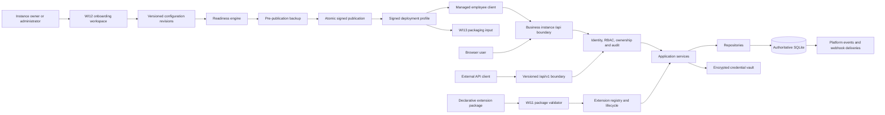

# Architecture

## Current implemented architecture

WhiteLabelCRM is a TypeScript npm workspace monorepo supporting two explicit runtime topologies:

- a standalone local-first application with an embedded backend and local SQLite database;
- a managed employee client connected to one centrally operated business instance.

Workspace responsibilities:

- `shared/` — runtime contracts and Zod validation, including WI12 onboarding and deployment-profile schemas;
- `backend/` — Express APIs, application services, repositories, SQLite persistence, migrations, schedulers, integrations, backups, onboarding publication and extension lifecycle;
- `frontend/` — React/Vite application, persistent onboarding workspace and extension runtime UI;
- `desktop/` — Electron security boundary, standalone bootstrap, signed profile verification and managed-client binding;
- `scratch/` — deterministic migration, work-item, packaging, dependency and security gates.



## Runtime topologies

### Managed business instance

Managed deployment is the recommended multi-employee topology:

- one authoritative backend and database;
- employees use branded desktop clients or a supported browser;
- the Electron client validates a packaged Ed25519-signed profile;
- the profile binds the client to one instance ID, signing key and exact HTTPS origin;
- the client does not start the embedded backend or open a local authoritative CRM database;
- backups, migrations and restore operations remain central server responsibilities.

The managed client may retrieve a newer profile from the bound instance. It rejects checksum failure, signature failure, signing-key replacement, instance-ID mismatch, URL replacement, revision downgrade and an unsupported minimum client version.

### Standalone local instance

Standalone mode retains the existing embedded backend and local SQLite deployment. It is intentionally isolated and is not represented as a shared multi-user topology.

Copying a configured live SQLite database onto several employee machines is prohibited. It would create divergent sources of truth, conflicting audit histories and unsafe credential distribution.

## Request and security boundary

All internal and public API traffic passes through:

1. request ID and security headers;
2. exact origin policy;
3. bounded rate limiting;
4. identity resolution;
5. explicit permission enforcement;
6. ownership assignment;
7. immutable recursively redacted audit capture.

Users, teams, roles, permissions and expiring sessions live in SQLite. Passwords, sessions, API tokens and enrolment tokens are hash-only at rest. Provider, webhook and signing secrets are stored in `CredentialVault` outside SQLite.

Loopback-trusted named profiles are a standalone convenience for internal routes. They are not accepted by `/api/v1` or `/api/platform`.

WI12 permissions are:

- `onboarding.read`;
- `onboarding.manage`;
- `deployment.publish`;
- `devices.manage`.

Only signed public-profile discovery and one-time enrolment redemption are deliberately pre-authentication. Draft, validation, publication, rollback, enrolment issuance and device administration remain authenticated and permission checked.

## Configuration and publication boundary

WI12 replaces ad hoc business setup with one canonical configuration registry.

`crm_instances` stores stable instance identity and the active publication pointer. `instance_configuration_revisions` stores editable drafts and immutable historical payloads. `instance_publications` stores the signed deployment envelope. Readiness, enrolment and device records have separate tables.

Revision lifecycle:

```text
draft → published → superseded
                  ↘ rollback produces a new publication
```

Publication:

1. validates the complete configuration contract;
2. records machine-readable readiness evidence;
3. blocks required failures;
4. creates a pre-publication backup;
5. deterministically serializes the profile;
6. computes a SHA-256 checksum;
7. signs with the instance Ed25519 private key held in the vault;
8. atomically activates the revision and mirrors compatible legacy settings;
9. opens the next draft;
10. emits immutable audit and platform events.

A failed publication leaves the prior revision active.

Existing installations migrate their current `settings` row into an initial published revision and receive a cloned editable draft. Existing branding and financial surfaces continue to read the canonical compatibility row until they are migrated directly to the registry.

## Deployment-profile boundary

A signed profile contains only safe runtime identity and presentation data:

- schema and configuration revision;
- instance ID;
- deployment mode and approved managed origin;
- business display identity;
- bounded embedded branding assets;
- locale and terminology;
- capability identifiers;
- minimum client version;
- publication timestamp.

It excludes passwords, sessions, API or OAuth tokens, employee enrolment tokens, backup passwords, cloud credentials, encryption keys, private signing keys, customer data and the live database.

The packaged profile is the managed client's trust anchor. Remote refresh cannot silently replace it.

## Employee provisioning

Employee activation uses cryptographically random one-time enrolment tokens. Only a SHA-256 hash and non-secret prefix are stored. Tokens are user-bound, instance-bound, expiring, device-limited and revocable.

Redemption registers a fingerprint hash and exchanges the token for a normal user-scoped session. The raw token is shown once and is redacted from request and response audit payloads. Device revocation conservatively revokes the user's active sessions.

## Internal and public HTTP APIs

The React frontend uses internal unversioned `/api` routes. They are not external compatibility commitments.

WI10 `/api/v1` remains explicitly allow-listed and accepts ordinary bearer sessions or scoped `wlc_` API tokens. Unsupported internal routes return public-API `404` responses rather than becoming accidental contracts.

WI11 extension lifecycle and WI12 onboarding lifecycle routes remain internal APIs. External integrations use WI10 events, webhooks and the stable API rather than direct database access.

## Application and persistence layering

```text
Express route
  → application service or bounded runtime service
  → repository
  → SQLite / verified filesystem / standards-based adapter
```

SQLite remains the authoritative persistence layer. Drizzle migrations establish the original schema; later idempotent work-item bootstraps add tables, indexes, triggers and compatibility backfills. Tests and smoke checks use isolated temporary databases.

Audit events, platform events and deployment publications are immutable through SQLite triggers.

## WI11 extension boundary

Extension packages remain declarative. They may contribute namespaced fields/entities, forms, views, navigation, bounded themes, supported reports, workflow templates, event metadata, localisation and verified static assets.

Packages cannot execute JavaScript, SQL, shell code or renderer bundles and receive no database or credential access. Extension reports use the existing reporting repository; workflow templates instantiate disabled allow-listed workflows.

Disablement preserves definitions and values. Purge requires disabled state, exact confirmation and a successful backup. Recovery remains a full-database restore rather than an isolated reverse migration.

## Credentials and external operations

`CredentialVault` uses AES-256-GCM envelopes under the runtime data directory. SQLite stores only non-secret credential references and operational metadata.

IMAP and CalDAV keep cursors and reconciliation state. SMTP and remote calendar changes use outbound journals. Webhooks use immutable platform events and persistent delivery rows.

Webhook destinations require HTTPS, reject credentials and fragments, block private/special-use destinations, re-check DNS and do not follow redirects. Loopback HTTP is available only through explicit test/development configuration.

## Electron boundary

`desktop/src/main.ts` owns the privileged process and `desktop/src/preload.ts` exposes a narrow IPC surface.

Both modes retain context isolation, renderer sandboxing, exact-origin navigation, denied popups and filesystem containment. Managed mode additionally disables local backup/restore selection and does not load the backend native module.

Final profile-driven Windows, Linux and container publication, release signing, SBOM publication and installed-artifact certification are WI13 concerns.

## Build and verification

`npm run ci:verify` runs:

- all workspace builds and tests;
- parser, package, workflow and production-dependency governance;
- isolated migration smoke;
- permanent WI4–WI12 regression suites;
- onboarding publication and enrolment tests;
- signed managed-client profile tests;
- Electron security and staged dependency checks.

Linux packaging remains a separate produced-artifact workflow.

## Current limitations and deferred work

- Managed deployment remains one authoritative SQLite application instance, not an active-active cluster.
- Managed clients do not provide offline writes or local conflict reconciliation.
- Standalone installations do not synchronise with one another.
- Legacy bookings, invoices, payments and some custom records remain customer-parented.
- Credit notes and parts of the financial lifecycle remain incomplete.
- The public API remains deliberately narrower than the internal UI API.
- Full E2E, WCAG certification, performance budgets, Windows/container publication and release provenance are deferred to WI13.
