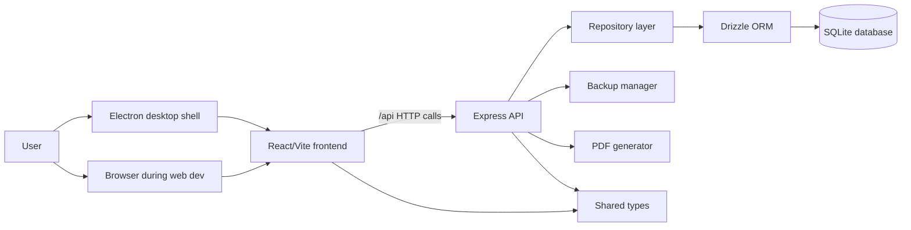
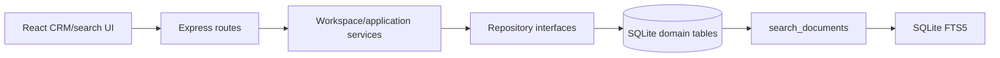

# Architecture

## Current implemented architecture

WhiteLabelCRM is a TypeScript npm workspace monorepo:

- `shared/` builds shared runtime/type contracts for other workspaces.
- `backend/` contains the Express API, database schema, Drizzle migrations, repositories, backup management, CSV import, and PDF generation.
- `frontend/` contains the React/Vite single-page application.
- `desktop/` contains Electron main/preload code, Forge configuration, and staging logic for packaged desktop builds.
- `scratch/` contains repository validation and release helper scripts.

### Runtime boundaries
The frontend is a client application that calls backend `/api` endpoints. The backend owns persistence, migrations, backups, imports, and PDF generation. Electron embeds the built frontend and starts or talks to the backend through the desktop shell rather than moving business logic into the renderer.

### Frontend to API interaction
`frontend/src/lib/api.ts` centralizes HTTP calls to the Express API. Vite development proxies `/api` to `http://localhost:5000`; production desktop builds copy `frontend/dist` into the Electron staging area.

### Application, repository, and database layering
Backend routes in `backend/src/presentation/routes/` expose CRM resources. Repository implementations in `backend/src/infrastructure/database/repositories/` use Drizzle and SQLite schema definitions from `backend/src/infrastructure/database/schema.ts`. Application interfaces in `backend/src/application/interfaces/` describe repository contracts.

### SQLite and Drizzle responsibilities
SQLite is the local runtime database. Drizzle defines typed tables, relations through foreign keys, and migration execution. The current migration SQL and Drizzle metadata live in `backend/drizzle/`; `backend/src/infrastructure/database/migrate.ts` runs Drizzle migrations against the currently opened database or configured runtime database.

### Electron embedding model
`desktop/src/main.ts` is the Electron main process and `desktop/src/preload.ts` is the preload boundary. Packaging uses `desktop/stage.js` to build workspaces, pack `shared` and `backend`, copy compiled desktop files, copy `frontend/dist`, copy `backend/drizzle`, install staging dependencies, and invoke Electron Forge with `desktop/forge.config.js`.

### Runtime paths
`backend/src/config/runtimePaths.ts` defines the active data directory, SQLite database path, internal backup directory, temporary directory, and log directory. Defaults are under the backend data directory for development. Desktop runtime configuration may override these paths for a user profile. Tests and smoke checks must open explicit temporary databases and never use the normal user or development database path.

### Build and packaging flow
The root build runs, in order: the shared build, backend build, frontend build, desktop TypeScript build, and licence-notice generation. Desktop packaging remains distinct from this compile/build process: packaging stages compiled assets and invokes Electron Forge. The packaged launch smoke test is local/release-oriented because it launches a packaged binary and may require package and display support.

## Target hardening direction
- Keep CI focused on deterministic, headless quality gates.
- Centralize financial calculations so invoices, repositories, and PDFs cannot drift.
- Strengthen migration validation against fresh and existing databases with backups before destructive-risk work.
- Make desktop package validation progressively more reliable without broad product changes.

## Deferred work
- Frontend workflows for organisations, contacts and engagements remain deferred; the backend domain model is implemented.
- Full reliable packaged Electron launch smoke testing in GitHub Actions is deferred until desktop hardening.
- Runtime data migration and backup/restore hardening beyond smoke coverage is deferred.

## Current limitations and risks
- Customer modelling is individual-first with an optional company field.
- Some financial calculation responsibilities appear in multiple layers and should be consolidated before behaviour changes.
- The desktop staging directory currently contains generated artifacts in the repository and should be reviewed separately rather than removed in this governance PR.
- The full desktop smoke test is not a mandatory headless CI check.

## B2B CRM domain services

Organisations, contacts and engagements use the dependency direction `Express route -> application service -> repository interface -> SQLite/Drizzle schema`. The service layer is intentionally small and handles cross-table business rules such as archived parent checks, one-primary-contact semantics, engagement primary-contact eligibility and date-range validation.

Repository interfaces live under `backend/src/application/interfaces/`, and SQLite implementations live under `backend/src/infrastructure/database/repositories/`. The new domain coexists with the legacy customer model: bookings, invoices, payments and custom object records continue to reference `customers`, while organisations own only contacts and engagements.

## WI3 activity and legacy-customer bridge

Activities are the canonical interaction history. Each note, call, email, meeting,
message or other interaction is stored as one `activities` row linked to an
organisation and optionally to a contact and engagement. Activity ownership is
explicit through foreign keys; archive is soft and timestamp-based.

Legacy customers remain the parent of bookings, invoices, invoice items and
payments. `legacy_organisation_mappings` and `legacy_customer_crm_mappings`
provide an additive compatibility bridge without rewriting those financial
relationships. Company mapping uses exact Unicode-NFKC, whitespace-collapsed,
case-normalised keys. Individual customers receive dedicated imported
organisations. No fuzzy matching to manually created organisations occurs.

After structural migrations, a synchronous idempotent backfill maps legacy
customers and imports the preserved `customers.notes` text into independent
`type = note` activities. Imported rows use `Legacy import`,
`source = legacy_import` and deterministic SHA-256 source references.
`customers.notes` remains preserved as deprecated source data and is no longer
parsed or appended by the production frontend.

Author labels are not authenticated identities in WI3. Ordinary activity writes
default to `Local user`. Authentication, tasks, reminders, documents, financial
migration and a full organisation workspace remain deferred.

## WI4 organisation-first workspace

WI4 adds an organisation-first application layer above the WI2/WI3 CRM domain. Express workspace routes call `WorkspaceService`, which depends on `IWorkspaceRepository`; the SQLite implementation owns organisation directory projections, unified timeline queries, follow-up queues, saved views and operational dashboard calculations.

`search_documents` is a normalized projection of organisations, contacts, engagements, activities, legacy customers and invoices. A content-linked SQLite FTS5 virtual table indexes title, subtitle and body. Domain-table triggers keep the projection synchronized, and migration startup performs a deterministic rebuild after the WI3 compatibility backfill. Search is local-only and no external search service is used.

Saved views persist versioned, schema-validated filter definitions rather than executable SQL. Follow-up completion is stored on the source activity using `follow_up_completed_at`; completion never archives the activity. The organisation timeline unions activity, engagement, booking, invoice and payment events in a stable backend-defined order.
